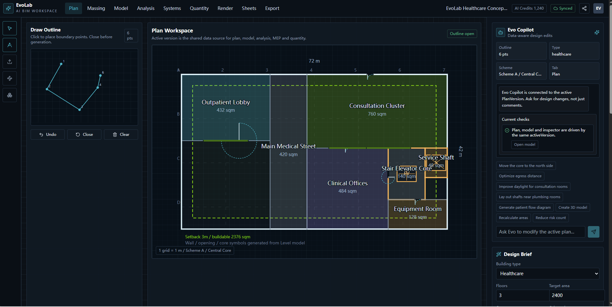
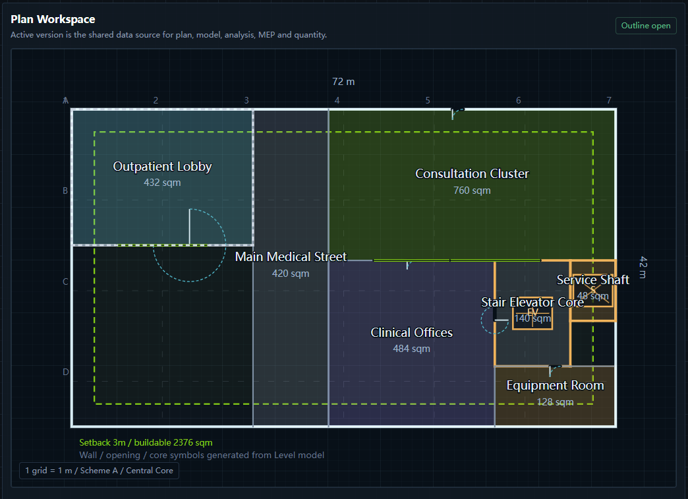
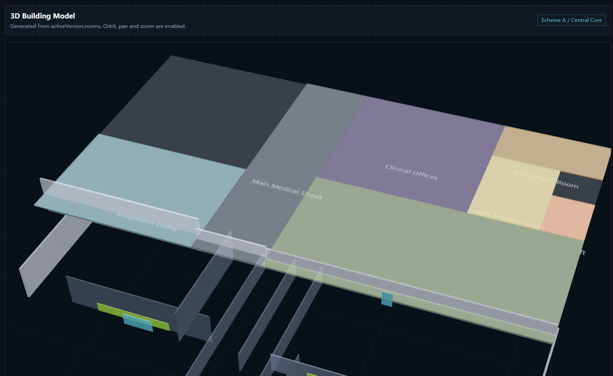
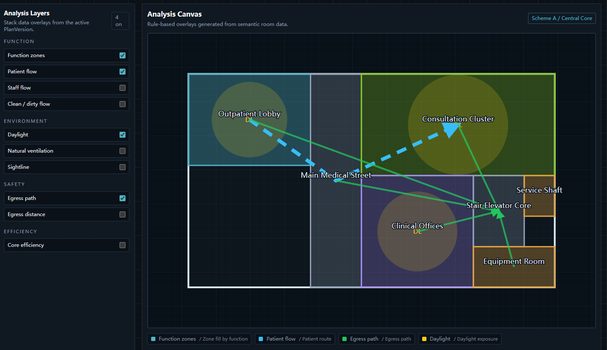
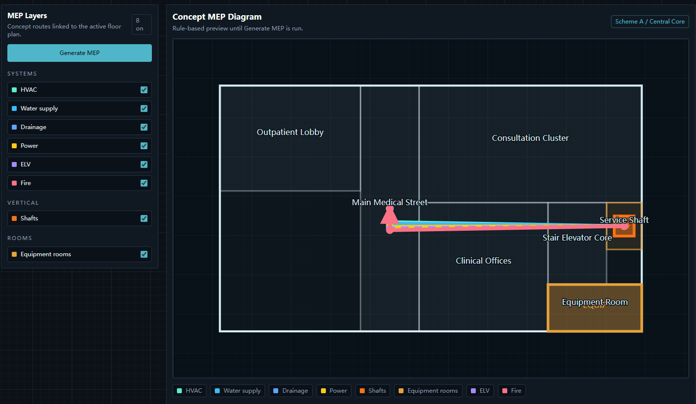
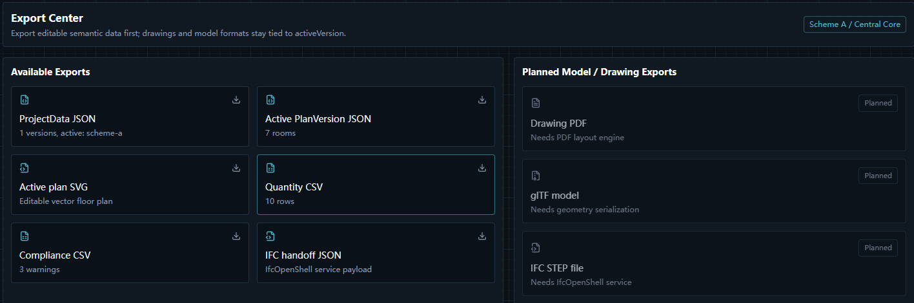

# EvoLab

[](https://github.com/Theopote/EvoLab/actions/workflows/ci.yml)
[](https://vercel.com/new/clone?repository-url=https://github.com/Theopote/EvoLab&env=ANTHROPIC_API_KEY&envDescription=Optional%20-%20leave%20blank%20to%20run%20in%20mock%20mode)

**AI-assisted architectural design workspace for early-stage building planning.**

EvoLab is not a one-shot image generator. It keeps plan options, analysis overlays, MEP diagrams, quantity takeoff, version comparison, rendering briefs, and exports all tied to one editable semantic data model — so every output traces back to a decision you can change.

## Why EvoLab

- End-to-end workflow from editable plan data to 2.5D/3D, systems, analysis, quantities, and export.
- AI is used for structured decisions and generation, while geometric and quantity outputs stay deterministic.
- Mock mode keeps the full product experience available for demos without requiring cloud keys.

---

## Screenshots

Real workflow snapshots from this repository build:


| Draw outline & brief | Generated plan options | 3D model |
|---|---|---|
|  |  |  |

| Analysis overlays | MEP systems | Export center |
|---|---|---|
|  |  |  |

---

## Core Workflow

```text
Input conditions → ProjectData → editable PlanVersion → plan / massing / model / analysis / systems / quantities / sheets / export
```

## Live Demo

Public demo URL is not pinned yet. You can launch your own demo in one click (mock mode supported):

[](https://vercel.com/new/clone?repository-url=https://github.com/Theopote/EvoLab&env=ANTHROPIC_API_KEY&envDescription=Optional%20-%20leave%20blank%20to%20run%20in%20mock%20mode)

To force mock mode on any deployment, set `NEXT_PUBLIC_MOCK_MODE=true` in your environment variables. The full UI — 3D model, floor plan, MEP diagrams, quantity takeoff — works without an API key.

## Current Status

This repository contains a working Next.js prototype with:

- Editable project data model in `lib/project-types.ts`
- Mock seed project data in `lib/evolab-data.ts`
- AI API route layer with Anthropic SDK integration and safe mock fallback
- Plan outline drawing and brief input
- Plan option generation through `/api/generate-plan`
- Active version selection and shared state
- 2.5D massing view
- 3D model view using React Three Fiber
- Data-driven analysis overlays
- Data-driven MEP system diagrams
- Pure-function quantity takeoff and compliance checks
- Copilot panel that calls `/api/modify-plan`
- Version comparison
- Render brief workspace
- Export center for JSON, SVG, CSV, and IFC handoff payload outputs
- Bottom task/status panel

## Tech Stack

- Next.js 14 App Router
- TypeScript
- React 18
- Tailwind CSS
- lucide-react
- three
- @react-three/fiber
- @react-three/drei
- @anthropic-ai/sdk

## Getting Started

Quick start in local mock mode:

```bash
npm install
```

Create `.env.local`:

```env
NEXT_PUBLIC_MOCK_MODE=true
ANTHROPIC_API_KEY=your_key_here
```

Then run:

```bash
npm run dev
```

Production or real AI testing can disable mock mode by setting `NEXT_PUBLIC_MOCK_MODE=false` and providing a valid API key.

---

Standard setup:

Install dependencies:

```bash
npm install
```

Run the development server:

```bash
npm run dev
```

Open:

```text
http://localhost:3000
```

If PowerShell blocks `npm.ps1`, use:

```powershell
& 'C:\Program Files\nodejs\npm.cmd' run dev
```

## Environment

Create `.env.local`:

```env
ANTHROPIC_API_KEY=your_key_here
# Set to "true" to force mock mode regardless of API key (useful for demos/Vercel)
NEXT_PUBLIC_MOCK_MODE=false
```

When `ANTHROPIC_API_KEY` is missing or still set to `your_key_here`, **or** when `NEXT_PUBLIC_MOCK_MODE=true`, all API routes return deterministic mock data so the full UI remains usable.

The configured model is:

```text
claude-sonnet-4-20250514
```

## Scripts

```bash
npm run dev
npm run build
npm run typecheck
npm run lint
```

## Workspace Tabs

### Plan

The plan workspace supports:

- Drawing an outline polygon
- Closing, undoing, and clearing outline points
- Entering a design brief
- Calling `/api/generate-plan`
- Displaying candidate PlanVersion options
- Setting the active scheme

### Massing

The massing workspace generates a simplified 2.5D SVG massing view from `activeVersion.rooms`. Room volume height is derived from room type and ceiling height.

### Model

The model workspace uses React Three Fiber to render an interactive 3D white model from `activeVersion.rooms`.

Key files:

- `components/viewer-3d/Scene.tsx`
- `components/viewer-3d/BuildingModel.tsx`
- `components/viewer-3d/wallGeometry.ts`
- `components/viewer-3d/materials.ts`

### Analysis

The analysis workspace overlays rule-based diagrams on the active floor plan.

Supported layers include:

- Function zones
- Patient flow
- Staff flow
- Clean / dirty flow
- Daylight
- Natural ventilation
- Sightline
- Egress path
- Egress distance
- Core efficiency

### Systems

The systems workspace renders conceptual MEP diagrams. It can call `/api/generate-mep` and write the returned `MepLayout` back to `activeVersion.mep`.

MEP uses a hybrid architecture:

- Anthropic Tool Use acts as the decision layer for system concept, shaft logic, served rooms, and assumptions.
- `lib/mep-router.ts` deterministically recalculates routes with corridor/service-room-first A* routing.
- Fallback and preview MEP use the same router, so demos do not depend on freehand AI geometry.

Supported MEP layers include:

- HVAC
- Water supply
- Drainage
- Power
- ELV
- Fire
- Shafts
- Equipment rooms

### Quantity

Quantity takeoff and compliance checks are pure functions in `lib/quantity-engine.ts`.

Calculated quantities include:

- Gross building area
- Net usable area
- Area by zone
- Area by room type
- External wall length
- Internal wall length estimate
- Wall area estimate
- Door count
- Window count
- Floor slab area
- Roof area
- Curtain wall / window area estimate

Compliance checks include:

- Corridor width
- Egress travel distance
- Daylight for main rooms
- Plumbing proximity to shafts or equipment rooms
- Stair / vertical core presence
- Equipment and shaft alignment

### Render

The render workspace creates a render brief from the editable active model. It does not generate final images yet. This keeps the core outcome editable and data-driven.

### Sheets

The sheets workspace currently provides version comparison:

- Side-by-side plan option cards
- Recommended version badge
- Score comparison
- Active version switching
- Compare pins
- Model and refine shortcuts

### Export

The export workspace currently supports:

- ProjectData JSON
- Active PlanVersion JSON
- Active plan SVG
- Quantity CSV
- Compliance CSV
- IFC handoff JSON for a future IfcOpenShell exporter

Planned export targets:

- Drawing PDF
- glTF
- IFC STEP file

## API Routes

All AI API routes live under `app/api`.

### `POST /api/generate-plan`

Input:

```ts
{
  outline: Point[]
  brief: string
  projectType: string
}
```

Output:

```ts
{
  versions: PlanVersion[]
}
```

Fallback returns three mock `PlanVersion` objects.

### `POST /api/analyze-plan`

Input:

```ts
{
  imageBase64?: string
  fileName?: string
}
```

Output:

```ts
{
  version: PlanVersion
  confidence: number
  warnings: string[]
}
```

### `POST /api/modify-plan`

Input:

```ts
{
  currentVersion: PlanVersion
  userRequest: string
}
```

Output:

```ts
{
  version: PlanVersion
  findings: CopilotFinding[]
}
```

### `POST /api/generate-diagram`

Input:

```ts
{
  version: PlanVersion
  layers: AnalysisLayerId[]
}
```

Output:

```ts
{
  svg?: string
  overlays?: unknown
}
```

### `POST /api/generate-mep`

Input:

```ts
{
  version: PlanVersion
}
```

Output:

```ts
{
  mep: MepLayout
  findings: CopilotFinding[]
}
```

The route treats AI output as a strategy/seed. Final `routes.path` geometry is normalized by `lib/mep-router.ts`.

### `POST /api/export-ifc`

Input:

```ts
{
  version: PlanVersion
}
```

Output:

```ts
{
  status: "handoff_ready"
  nextEngine: "IfcOpenShell"
  contentType: "application/json"
  payload: IfcExportPayload
}
```

This is an IFC handoff contract, not a final `.ifc` STEP file. The intended production route is to send this payload to a Python service using IfcOpenShell, then return `application/x-step` bytes for download.

## Core Data Model

The central model is `ProjectData`:

```ts
interface ProjectData {
  projectId: string
  projectName: string
  projectType: string
  versions: PlanVersion[]
  activeVersionId: string
}
```

Every major workspace reads from the active `PlanVersion`. New capabilities should extend `lib/project-types.ts` first instead of inventing separate state shapes.

## Project Structure

```text
app/
  api/
  globals.css
  layout.tsx
  page.tsx
components/
  diagrams/
  mep/
  plan-editor/
  quantity/
  version-compare/
  viewer-3d/
lib/
  prompts/
  anthropic-json.ts
  evolab-data.ts
  export-utils.ts
  ifc-export-contract.ts
  mep-router.ts
  mock-api.ts
  project-types.ts
  quantity-engine.ts
```

## Development Principles

- Shared structured data is the source of truth.
- AI returns editable JSON, not final raster images.
- Quantities and compliance checks are deterministic functions.
- Plan, model, analysis, systems, quantities, sheets, and export should update from the same active version.
- Mock fallback is required for all AI routes so the UI stays usable without an API key.

## Known Limitations

- PDF, glTF, and IFC STEP exports are placeholders. IFC handoff JSON is available for backend exporter integration.
- The 3D model is a schematic white model, not a BIM-grade wall/opening model.
- MEP routing is conceptual. Route geometry is deterministic and corridor-first, while AI is used for strategy and system assumptions.
- Analysis diagrams are rule-based overlays, not formal code compliance reports.
- Render tab creates a brief and preview model only; it does not call an image generation API.

## Verification

The current implementation has been checked with:

```bash
npm run typecheck
npm run lint
npm run build
```

CI runs these checks on push and pull request via `.github/workflows/ci.yml`.
